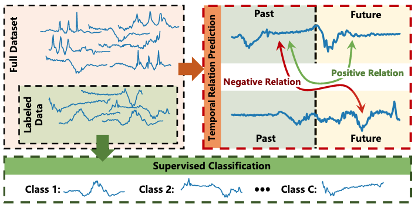
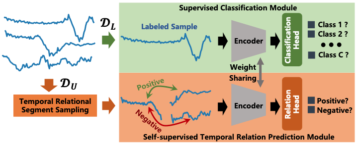

# Neural Networks Project -- SemiTime

This repository containts the project for Neural Network course of Artificial Intelligence and Robotics of La Sapienza University.

The project is based on this paper: **Semi-supervised time series classification by temporal relation prediction** (https://haoyfan.github.io/papers/SemiTime_ICASSP2021.pdf), which describes a novel approach for time series classification.
In this work the authors have proposed a method of semi-supervised time series classification architecture (termed as **SemiTime**) by gaining from the structure of unlabeled data in a self-supervised manner. 

|Schematic illustration of semi-supervised techniques described| SemiTime architecture|
|--------|--------|
|    |    |

## Requirements 
* Python 3.6
* Pytorch version 1.4

## Run model training

**Supervised**:
'''bash
python main.py --dataset CricketX --task supervised --run train
'''

**Semi-Supervised**:
'''bash
python main.py --dataset CricketX --task semi-supervised --run train
'''

## Run model test
The model is automatically tested after training. If you want to test it later: 

**Supervised**:
'''bash
python main.py --dataset CricketX --task supervised --run test
'''

**Semi-Supervised**:
'''bash
python main.py --dataset CricketX --task semi-supervised --run test
'''

or you can also use the provided jupyter notebook.